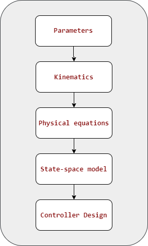
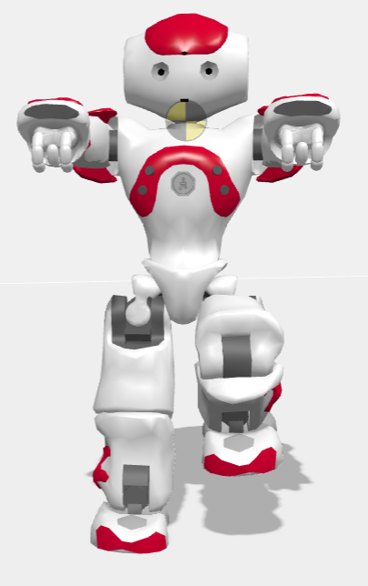

# Modeling

## Work Order

## Joints to model

| Joint Name            | Parameters | Forward Kinematics | Inverse Kinematics | Physical Equation | State-space Model | Controller |
|-----------------------|------------|--------------------|--------------------|-------------------|-------------------|------------|
| Head                  | ✅         | ✅                 | ❌                 | ✅                | ✅                | ✅         |
| ArmShoulder           | ❌         | ❌                 | ❌                 | ❌                | ❌                | ❌         |
| ArmElbow              | ❌         | ❌                 | ❌                 | ❌                | ❌                | ❌         |
| LegHip (Supported)    | ❌         | ❌                 | ❌                 | ❌                | ❌                | ❌         |
| LegKnee (Supported)   | ❌         | ❌                 | ❌                 | ❌                | ❌                | ❌         |
| LegAnkle (Supported)  | ❌         | ❌                 | ❌                 | ❌                | ❌                | ❌         |
| LegHip (Floating)     | ❌         | ❌                 | ❌                 | ❌                | ❌                | ❌         |
| LegKnee (Floating)    | ❌         | ❌                 | ❌                 | ❌                | ❌                | ❌         |
| LegAnkle (Floating)   | ❌         | ❌                 | ❌                 | ❌                | ❌                | ❌         |

---

For example, in the picture below, the right leg is supported, and the left leg is floating.

